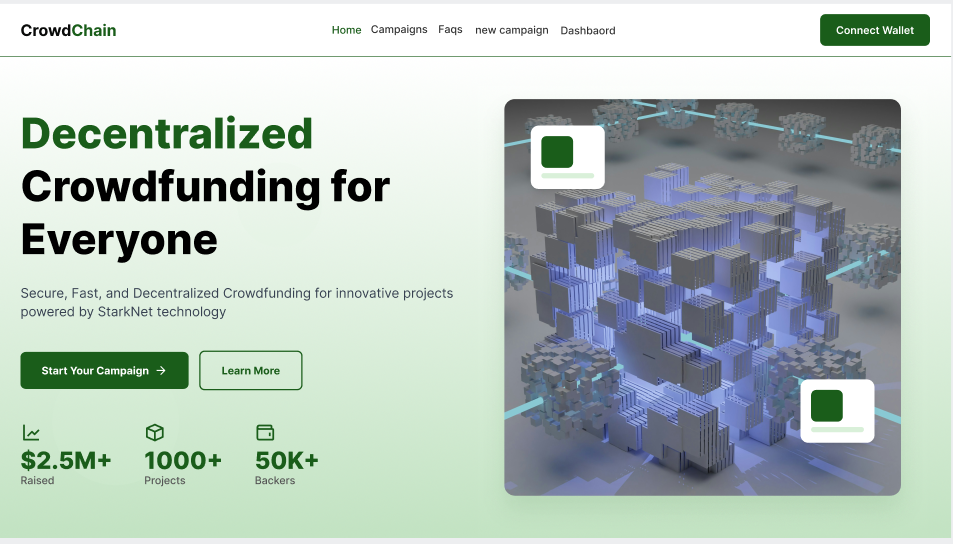

# Crowdchain


Empowering Community-Driven Funding

## Overview

Crowdchain is a decentralized crowdfunding platform designed to support impactful projects in health, education, and social welfare. Our mission is to make giving easy, efficient, and rewarding.

## Key Features

- **Optimized Gas Fees**: Streamlined platform architecture minimizing transaction costs
- **Leaderboard & Rewards**: Earn exclusive NFT rewards as a top contributor
- **Transparent Tracking**: Monitor contribution history and project impact

## Getting Started

### Prerequisites

- Node.js v16 or higher
- Yarn

### Installation

```bash
git clone https://github.com/Softalx-Solutions/crowdchain.git
cd crowdchain
yarn
```

### Running Tests

```bash
coming soon...
```

### Local Development

```bash
yarn dev

```

## Contributing

We welcome contributions! Please see our [Contributing Guidelines](CONTRIBUTING.md) for details.

## License

This project is licensed under the MIT License - see the [LICENSE](LICENSE) file for details.

## Contact

- Website: - [crowdchain.vercel.app](crowdchain.vercel.app)
- Telegram: [https://t.me/crowdchain1](https://t.me/crowdchain1)

